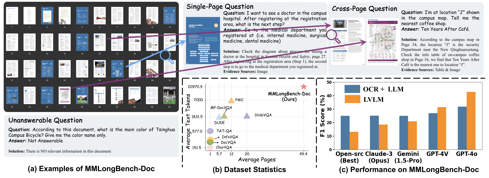

<p align="center">
  <h1 align="center">MMLONGBENCH-DOC: Benchmarking Long-context Document Understanding with Visualizations</h1>
    <p align="center">
    <a href="https://mayubo2333.github.io"><strong>Yubo Ma</strong></a>
    ·
    <a href="https://yuhangzang.github.io/"><strong>Yuhang Zang</strong></a>
    ·
    <a href="https://cliangyu.com/"><strong>Liangyu Chen</strong></a>
    ·
    <a href="https://chenmeiqii.github.io/"><strong>Meiqi Chen</strong></a>
    ·
    <a href="https://yzjiao.github.io/"><strong>Yizhu Jiao</strong></a>
    ·
    <strong>Xinze Li</strong>
    ·
     <a href="https://xinyuanlu00.github.io"><strong>Xinyuan Lu</strong></a>
      ·
     <a href="https://liuziyu77.github.io/"><strong>Ziyu Liu</strong></a>
    ·
    <strong>Yan Ma</strong>
    ·
    <a href="https://lightdxy.github.io/"><strong>Xiaoyi Dong</strong></a>
    ·
    <a href="https://panzhang0212.github.io/"><strong>Pan Zhang</strong></a>
    ·
    <a href="http://www.liangmingpan.com/"><strong>Liangming Pan</strong></a>
    .
    <strong>Yu-Gang Jiang</strong> 
    .
    <a href="https://myownskyw7.github.io/"><strong>Jiaqi Wang</strong></a>
    .
    <a href="https://sites.google.com/view/yixin-homepage"><strong>Yixin Cao</strong></a>
    .
    <a href="https://personal.ntu.edu.sg/axsun/"><strong>Aixin Sun</strong></a>
  </p>
  <!-- <h2 align="center">Submitted to arXiv</h2> -->
  📖<a href="https://arxiv.org/abs/2407.01523">Paper</a> |🏠<a href="https://mayubo2333.github.io/MMLongBench-Doc/">Homepage</a></h3>|🤗<a href="https://huggingface.co/datasets/yubo2333/MMLongBench-Doc">Huggingface</a></h3>
<div align="center"></div>
<p align="center">
  <p>
The automatic understanding of lengthy documents (Long-context Document Understanding; DU) stands as a long-standing task in urgent and practical needs. Although many LVLMs now claim (and show promising cases) their capabilities on long-context DU, there lacks a unified and quantitative evaluation of existing models due to the absence of related benchmark.<br>
To bridge this gap, we construct <strong>MMLongBench-Doc</strong> which comprises 135 documents and 1091 qustions (each accompanied by a short, deterministic reference answer and detailed meta information.). The documents have an average of 47.5 pages and 21,214 tokens, cover 7 diverse domains, and are PDF-formatted with rich layouts and multi-modal components. The questions are either curated from existing datasets or newly-annotated by expert-level annotators. Towards a comprehensive evaluation, the questions cover different sources like text, table, chart, image, etc., and different locations (page index) of the documents. Notably, 33.0% questions are cross-page questions necessitating comprehension and reasoning on evidences across multiple pages. And 22.5% questions are designed to be unanswerable for reducing the shortcuts in this benchmark and detecting LVLMs' hallucinations.
  </p>
  <a href="">
    
  </a>
<br>

## 📢 News
- 🚀 [07/2024] We further refine and update the questions in MMLongBench-Doc!
- 🚀 [07/2024] We have integrated MMLongBench-Doc to evaluation toolkit [VLMEvalKit](https://github.com/open-compass/VLMEvalKit), providing a highly convenient testing solution!
- 🚀 [06/2024] We upload MMLongBench-Doc to huggingface.

## 💡 Highlights
- 🔥 **Multi-modality**: All selected documents are PDF-formatted with rich layouts and multi-modal components including text, table, chart and image. We annotate questions carefully from these multi-modal evidences.
- 🔥 **Long-context**: Each document has an average of 47.5 pages and 21,214 tokens. Additionally, 33.0% of the questions are cross-page questions which necessitate the information collection and reasoning over multiple pages.
- 🔥 **Challenging**: Experiments on 14 LVLMs demonstrate that long-context document understanding greatly challenges current models. Even the best-performing LVLM, GPT-4o, achieves an overall F1 score of only 44.9%.

## Dataset
We save our benchmark, including both questions and documents, in `./data`.
* The questions are provided in json format and contain the following attributes:
```
    {
        "doc_id": "Independents-Report.pdf",
        "doc_type": "Research report / Introduction",
        "question": "What's the percentage of people who are democrats and voted in the last election compared to the entire population in 2018?",
        "answer": "18.29%",
        "evidence_pages": "[3, 5]",
        "evidence_sources": "['Pure-text (Plain-text)']",
        "answer_format": "Float",
    }
```
* The documents are saved in `./data/documents` as the format of PDF files.

You can also download this dataset by the following command (make sure that you have installed Huggingface Datasets):
```
from datasets import load_dataset
samples = load_dataset("yubo2333/MMLongBench-Doc/data")["train"]
```

## 🛠️ Usage
### Environment
```
python 3.9
2.1.2+cu121
```
You can install other dependencies by `pip install -r requirements.txt`.


### Quick Use
```
MODEL_NAME=[gpt-4o|gpt-4-turbo|gemini-1.5-pro-latest|internvl|4khd|minicpm_llama3] bash run.sh
```
Note that 
* `OPENAI_API_KEY` should be set no matter what models you are evaluating because we adopt a three-stage evaluation protocol as detailed in Section 4.1 of [our paper](https://arxiv.org/abs/2407.01523). The conversion from a long-form response to a short-form prediction necessitates GPT-4o's involving.
* We now support various popular open-source and closed-source LVLMs, including **GPT-4o**, **GPT-4V**, **Gemini-Pro-1.5**,**InternLM-Xcomposer2-4KHD**, **Intern-VL-Chat-v1.5** and **MiniCPM-Llama3-V2.5**. More LVLMs will be supported in the near future (we are cleaning related code).

## ✒️Citation
```
@misc{ma2024mmlongbenchdocbenchmarkinglongcontextdocument,
      title={MMLongBench-Doc: Benchmarking Long-context Document Understanding with Visualizations}, 
      author={Yubo Ma and Yuhang Zang and Liangyu Chen and Meiqi Chen and Yizhu Jiao and Xinze Li and Xinyuan Lu and Ziyu Liu and Yan Ma and Xiaoyi Dong and Pan Zhang and Liangming Pan and Yu-Gang Jiang and Jiaqi Wang and Yixin Cao and Aixin Sun},
      year={2024},
      eprint={2407.01523},
      archivePrefix={arXiv},
      primaryClass={cs.CV},
      url={https://arxiv.org/abs/2407.01523}, 
}
```

## 📄 License
  **Usage and License Notices**: The data and code are intended and licensed for research use only.
License: Attribution-NonCommercial 4.0 International It should abide by the policy of OpenAI: https://openai.com/policies/terms-of-use